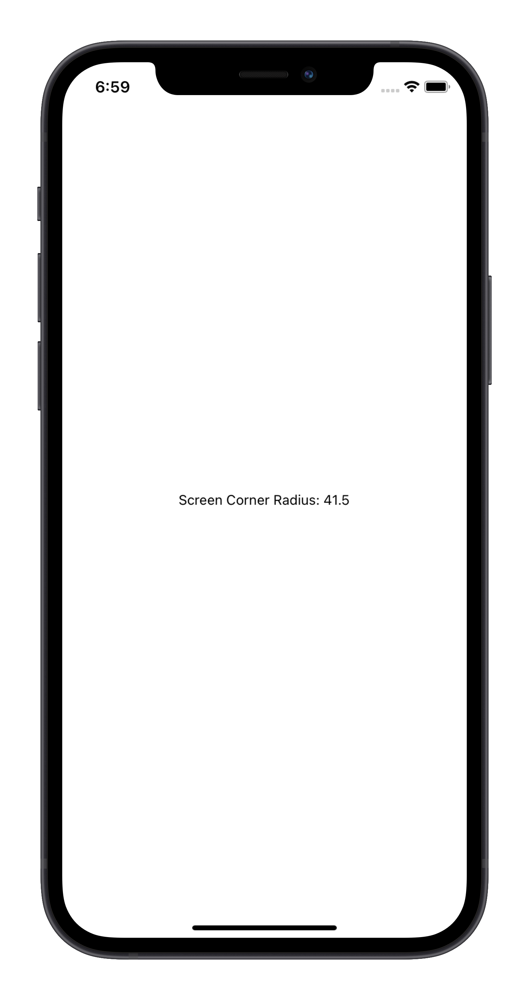

# react-native-screen-corner-radius

A React Native library to get the Device's Screen's corner radius.

<br />
<p align="center">
  
</p>
<br />

## Installation

```sh
npm install react-native-screen-corner-radius
cd ios
pod install
```

## Usage

```js
import { ScreenCornerRadius } from "react-native-screen-corner-radius"

console.log(`Screen Corner Radius: ${ScreenCornerRadius}`)
```

## Values reported

The following values were reported for various devices with rounded corners:

| Device | Value (pts) |
|--|--|
| iPhone X, Xs, Xs Max, 11 Pro, 11 Pro Max | 39.0 |
| iPhone Xr, 11 | 41.5 |
| iPhone 12 mini, 13 mini | 44.0 |
| iPhone 12, 12 Pro, 13 Pro, 14, 16e | 47.33 |
| iPhone 12 Pro Max, 13 Pro Max, 14 Plus | 53.33 |
| iPhone 14 Pro, 14 Pro Max, 15, 15 Plus, 15 Pro, 15 Pro Max, 16, 16 Plus | 55.0 |
| iPhone 16 Pro, 16 Pro Max, 17, 17 Pro, 17 Pro Max, Air | 62.0 |
| iPad Air / iPad Pro 11-inch / 12.9-inch | 18.0 |

## Warning

On iOS, this uses a private API. Since Apple doesn't allow the usage of private APIs, the selector is somewhat obscured, which usually means it will get past app review. However, use at your own risk!

## Contributing

See the [contributing guide](CONTRIBUTING.md) to learn how to contribute to the repository and the development workflow.

## License

MIT

## Credits

* [kylebshr/ScreenCorners](https://github.com/kylebshr/ScreenCorners) for the Swift implementation
